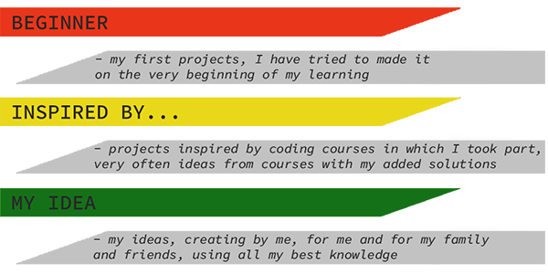
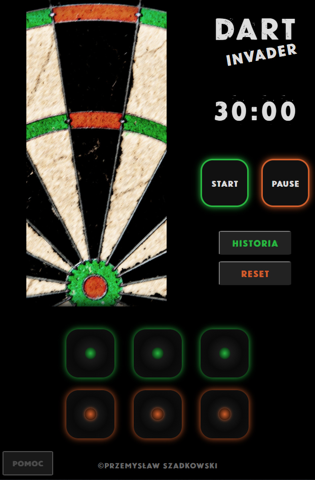
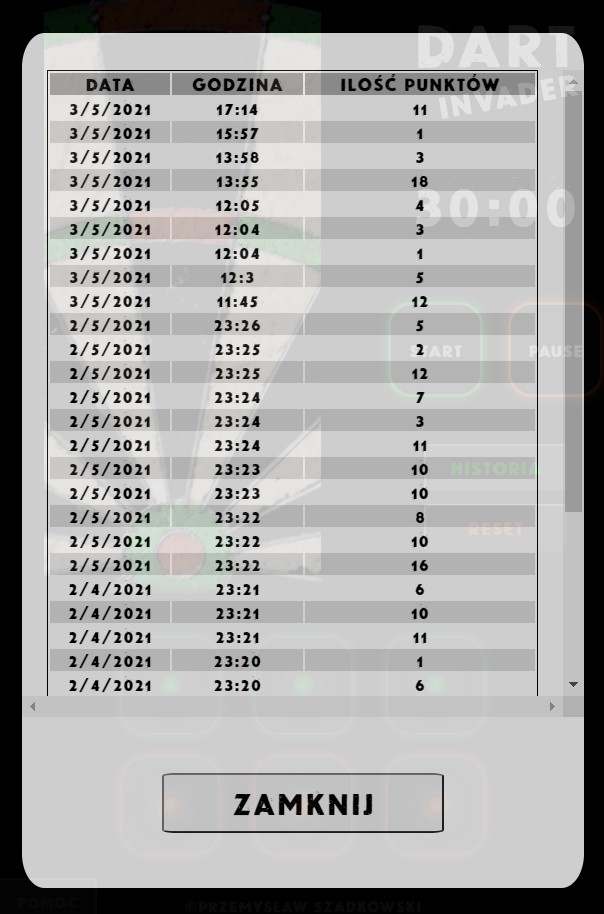

# Dart Invader
> Web application for dart players. With this app they can practice dart skills during 30 minutes sessions.

## Table of contents
* [Colors key](#colors-key)
* [General info](#general-info)
* [Screenshots](#screenshots)
* [Technologies](#technologies)
* [Features](#features)
* [Inspiration](#inspiration)
* [Contact](#contact)

## Colors-key

## General info
 Dart Invader is a project for all dart players. It is simple dart practice. User can start 30 minutes practice and during this time try to score all fields on dartboard. In the end player can see result and points. All practice results are saved in local storage so it is possible to check and control practice progress.

## Screenshots

## Technologies
* HTML 5
* CSS 3
* Javascript

## Features

Live demo https://przemek-szadkowski.github.io/dart_invader/

To-do list:
* add practice statistics
* add new feature - game with virtual player

## Status
Project is: _in progress

## Inspiration
This project is inspired by one of my hobby - dart:) I am trying to develop my skills and I'm searching for new practice possibilities so I decided to create my own practice method.

## Contact
Created by [przemoszadkowski@o2.pl](mailto:user@example.com) - feel free to contact me!